# Lecture Notes: The Missing Semester of Your CS Education

# Topic 1: The Shell & Command Line Environment

These notes condense the foundational concepts of navigating and utilizing the command-line interface, specifically focusing on the Bash shell.

---

## What is the Shell?

Computers offer multiple interfaces, such as Graphical User Interfaces (GUIs) and voice agents. However, GUIs are limited to the specific actions programmed by the developer. The **shell** is a textual interface that allows you to execute commands, chain programs together, and automate tasks at a lower, more flexible level.

* **Terminal:** The graphical window that displays the text.
* **Shell:** The underlying program (e.g., Bash, Zsh) parsing your text and executing commands.
* **Bash / Zsh:** The default shells on most Linux and macOS systems.
* **Windows Subsystem for Linux (WSL):** The recommended way to run a Bash-compatible environment on Windows.

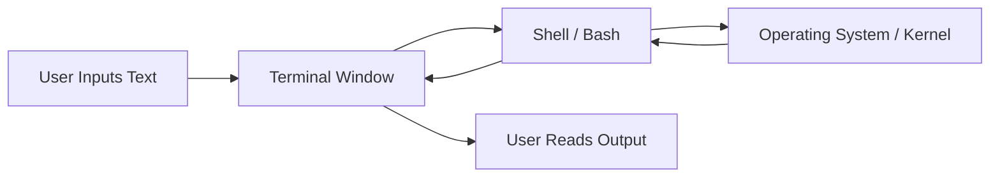

---

## Navigating the File System

The shell operates within a directory structure. Your prompt usually indicates your current working directory.

* **`~` (Tilde):** A shortcut representing your user's home directory.
* **`/` (Slash):** The root directory of the entire file system. Also used to separate directory components.
* **`.` (Dot):** Represents the current directory.
* **`..` (Dot-Dot):** Represents the parent directory.
* **Absolute Paths:** Start with the root `/` or home `~` and define the full location.
* **Relative Paths:** Start from the current working directory without a leading slash.

| Command | Action |
| --- | --- |
| `cd <path>` | Changes the current directory to the specified path. |
| `ls` | Lists the files and directories in the current directory. |
| `ls -l` | Lists files with detailed permissions and metadata. |
| `pwd` | Prints the absolute path of the working directory. |

---

## Programs, Arguments, and The $PATH

Commands are executed by typing the program name followed by arguments separated by whitespace.

* **Argument Parsing:** The shell splits your input by spaces. To include literal spaces in a single argument, enclose the string in quotes (`"hello world"`) or escape the space with a backslash (`hello\ world`).
* **`$PATH`:** An environment variable containing a colon-separated list of directories. When you type a command, the shell searches these directories in order to find the executable program.
* **`which <program>`:** Tells you the exact file path of the executable the shell is running.
* **`man <program>`:** Opens the manual page for a command, explaining its arguments and flags. Alternatively, use `<program> --help`.

---

## Text Processing and Searching Tools

The command line provides powerful, specialized utilities for manipulating data and files.

| Utility | Function |
| --- | --- |
| `cat <file>` | Prints the entire contents of a file to the terminal. |
| `head -n <#>` | Prints the first n lines of a file. |
| `tail -n <#>` | Prints the last n lines of a file. |
| `sort` | Sorts lines lexicographically (use `-n` for numerical). |
| `uniq` | Removes *consecutive* duplicate lines (often paired with `sort`). |
| `uniq -c` | Removes consecutive duplicates and prints the count of occurrences. |

### Advanced Search and Manipulation

* **`grep`:** Searches *inside* files for specific text or Regular Expressions. Example: `grep -r "todo" .` searches recursively in the current directory for the word "todo".
* **`sed`:** A stream editor used primarily for search and replace. Example: `sed -i 's/grep/john/g' *.md` replaces "grep" with "john" globally across all markdown files.
* **`find`:** Searches for files based on metadata (name, size, modification time) rather than content. It can also execute commands on the results. Example: `find . -name "*.txt" -mtime +30` finds text files older than 30 days.
* **`awk`:** A programming language for parsing and processing column-based or delimited text files.

---

## I/O Redirection and Pipes

The true power of the shell comes from combining simple programs to accomplish complex tasks.

* **`>` (Output Redirect):** Captures the output of a command and writes it to a file, overwriting existing content. Example: `date > current_date.txt`.
* **`>>` (Append):** Captures output and adds it to the end of a file without overwriting.
* **`<` (Input Redirect):** Feeds the contents of a file into a program's standard input.
* **`|` (Pipe):** Takes the output of the program on the left and feeds it directly as the input to the program on the right.

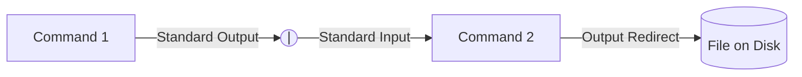

---

## Bash Scripting Basics

You can save shell commands into a text file to create reproducible scripts. Bash is a full programming language with control structures.

* **Variables:** Assigned without spaces (e.g., `foo=bar`) and accessed with a dollar sign (`$foo`).
* **Command Substitution:** Wrapping a command in `$(...)` executes it and replaces the expression with its output. Example: `for var in $(seq 1 10)`.
* **Conditionals:** The `test` command (or `[ ]`) evaluates conditions. Returns `0` for true/success and non-zero for false/failure.
* **Execution Permissions:** To run a script, the file must be marked as executable.

**Creating and Running a Script:**

1. Start the file with a **Shebang** (`#!/bin/bash` or `#!/usr/bin/env python`). This tells the system which interpreter to use.
2. Write your commands.
3. Add execution permissions using `chmod +x script.sh`.
4. Execute it explicitly from the current directory using `./script.sh`.

# Topic 2: The Command Line Environment

These notes summarize the core concepts of the command line environment, focusing on how programs interact, how to operate on remote machines, and how to customize your workspace.

---

## Program Inputs: Arguments & Globbing

Unlike traditional programming languages where inputs are explicitly passed into defined functions, shell programs receive inputs primarily as strings via arguments.

* **Flags:** Arguments starting with a dash (`-`) or double dash (`--`) alter a program's default behavior. Single-letter flags can often be combined (e.g., `ls -la` is equivalent to `ls -l -a`).
* **Multiple Arguments:** Many programs accept an arbitrary number of arguments to apply the same operation across multiple targets (e.g., `mkdir dir1 dir2 dir3`).
* **Globbing:** The shell evaluates pattern matching *before* passing the input to the program. For example, if you run `touch *.py`, the shell expands `*.py` into a list of all matching files in the directory and passes that entire list to `touch`.

---

## Streams and Pipelines

Programs communicate via continuous data streams. When you pipe commands together using `|`, the programs run in parallel, instantly passing data down the chain as it gets produced.

* **Standard Input (stdin):** How a program reads data. Often represented by a lone dash `-` in commands if the program expects a file but you want it to read from the pipeline instead.
* **Standard Output (stdout):** Where a program sends its successful output. Can be redirected to a file using `>`.
* **Standard Error (stderr):** A separate stream specifically for error messages. This ensures errors are not accidentally processed by the next program in a pipeline or written to a standard output file.
* **`/dev/null`:** A special file that acts as a black hole. Writing standard output or error streams here simply discards the data.

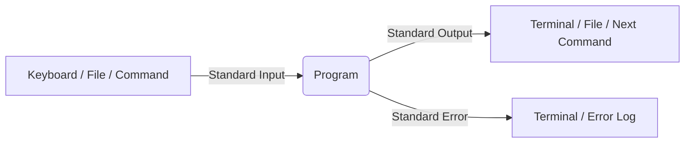

---

## Environment Variables & Return Codes

Variables in the shell dictate how programs behave and how they find information.

* **Syntax:** Define variables without spaces (`foo=bar`). Access them with a dollar sign (`$foo`).
* **Local vs. Exported:** By default, variables only exist in the current shell session. Use `export debug=1` to ensure that any child processes spawned by the shell also inherit the variable.
* **Common Variables:** `$HOME` defines the user's home directory. `$TZ` defines the time zone. `$PATH` is a list of directories the shell searches to find executable commands.

**Return Codes**
Every program exits with a numerical return code (exit status) indicating success or failure.

* **`0`:** Success.
* **Non-zero (e.g., 1, 2):** Failure or error.
* **Control Flow:** The `&&` (AND) operator runs the next command *only* if the previous returned `0`. The `||` (OR) operator runs the next command *only* if the previous failed.

---

## Signals

Signals are software interrupts sent to a running program. A program can be programmed to catch a signal (e.g., to cleanly delete temporary files before closing) or ignore it completely.

| Keybind / Command | Signal | Description |
| --- | --- | --- |
| `Ctrl+C` | `SIGINT` | Interrupt signal. Requests the program to terminate. |
| `Ctrl+\` | `SIGQUIT` | Quit signal. A more forceful request to terminate. |
| `Ctrl+Z` | `SIGTSTP` | Suspend signal. Pauses the program and pushes it to the background. |
| `kill <PID>` | Any | A command used to send arbitrary signals to a specific Process ID. |

---

## Remote Machines & SSH

The Secure Shell (SSH) protocol allows you to control remote computers as if you were sitting in front of them.

* **Connecting:** `ssh username@server_address`
* **Public Key Authentication:** Instead of typing passwords, use cryptographic keys. Generate a pair using `ssh-keygen`.
* **Public Key:** Shared with the server (e.g., using `ssh-copy-id`). It identifies you.
* **Private Key:** Stays on your machine. *Never share this.* It is highly recommended to protect it with a local passphrase.
* **Remote Execution:** You can pass a command directly through SSH (e.g., `ssh user@server ls -l`). The command executes remotely, but the standard output streams back to your local terminal.
* **Copying Files:** Use Secure Copy (`scp local_file user@server:remote_path`) to transfer files over the SSH protocol.

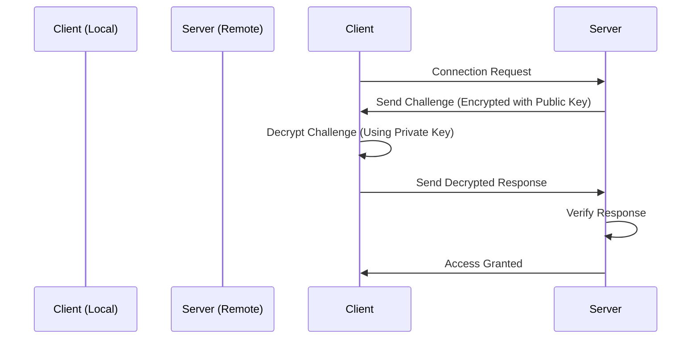

---

## Terminal Multiplexers

When you disconnect from an SSH session, the server sends a `SIGHUP` (hangup) signal, terminating all your running programs. Terminal multiplexers (like `tmux`) prevent this by keeping a persistent session alive on the remote server.

* **Windows & Panes:** Allow you to run multiple terminal tabs (windows) and split screens (panes) within a single SSH connection.
* **Detaching (`Ctrl+b`, `d`):** Leaves the multiplexer running in the background. You can disconnect from SSH, go home, reconnect, and run `tmux attach` to pick up exactly where you left off.

---

## Customizing Your Environment

The shell is highly customizable, though setup varies between operating systems and specific shell programs (Bash vs. Zsh).

* **Package Managers:** Use tools like `brew` (macOS) or `apt` (Debian/Ubuntu) to install missing programs (e.g., `tmux`, `ripgrep`).
* **Configuration Files:** Changes made directly in the terminal (like `export PATH=...`) are lost when the session ends. To make them permanent, add them to your shell's configuration file (`~/.bashrc`, `~/.bash_profile`, or `~/.zshrc`).
* **Dotfiles:** It is best practice to store your configuration files in a version-controlled folder (like a Git repository) and use "symlinks" to point your operating system to them. This makes setting up a new computer frictionless.
* **Plugins:** Frameworks and independent plugins can add syntax highlighting, auto-completion, rich Git integrations in your prompt (`PS1`), and fuzzy-finding for your command history (e.g., `fzf` mapped to `Ctrl+R`).

# Topic 3: Development Environment and Tools

These notes summarize the concepts, tools, and workflows of a modern software development environment, with a deep dive into Vim, Language Servers, and AI-powered coding tools.

---

## Development Environments

A development environment is the set of tools you use to write, test, and debug software. They generally fall into two categories:

* **Terminal-based Environments:** Command-line configurations (e.g., combining Tmux, a shell, and a text editor like Vim). These are highly customizable and essential when SSH-ing into remote machines where graphical software cannot easily be installed.
* **Integrated Development Environments (IDEs):** Graphical applications (e.g., VS Code, Cursor) that consolidate text editing, file management, terminal access, and advanced features (like AI and debugging) into a single unified interface.

---

## Vim & Modal Editing

When writing code, you rarely write top-to-bottom like an essay. You jump around, read snippets, fix bugs, and write small blocks. **Vim** is a text editor designed explicitly for this non-linear workflow.

Vim's core philosophy is that switching between the keyboard and mouse is slow. Instead, it turns text editing into a "programming language" where you use keystrokes to navigate and manipulate text rapidly without your hands leaving the home row.

### The Modes of Vim

Vim is a **modal editor**, meaning the same keys do different things depending on which mode you are in.

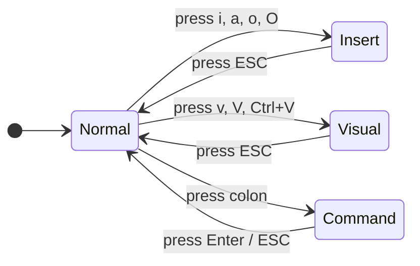

* **Normal Mode (Default):** For navigating the file and manipulating text. You cannot type standard text here.
* **Insert Mode (`i`):** Behaves like a standard text editor. What you type goes into the file.
* **Visual Mode (`v`, `V`, `Ctrl+V`):** For selecting text (characters, lines, or rectangular blocks).
* **Replace Mode (`R`):** For overwriting text.
* **Command Mode (`:`):** For executing editor commands (saving, quitting, searching).

### The Vim "Grammar"

In Normal mode, Vim acts like a language consisting of **Movements**, **Counts**, **Edits**, and **Modifiers**. You combine these to perform complex actions instantly.

#### Basic Movements

| Key | Action | Key | Action |
| --- | --- | --- | --- |
| `h` / `j` / `k` / `l` | Left / Down / Up / Right | `gg` / `G` | Top of file / Bottom of file |
| `w` / `b` | Forward a word / Back a word | `0` / `$` | Start of line / End of line |
| `f<char>` | Find next instance of `<char>` | `%` | Jump to matching bracket/parenthesis |

#### Editing Commands

| Key | Action |
| --- | --- |
| `o` / `O` | Open a new line below / above and enter Insert mode |
| `d` | Delete (must be combined with a movement, e.g., `dw` deletes a word) |
| `c` | Change (deletes and immediately enters Insert mode) |
| `u` | Undo |

#### Composition (Verbs + Modifiers + Nouns)

The true power of Vim is chaining these together: `[Count] + [Operator/Edit] + [Modifier] + [Movement/Noun]`.

* **Counts:** `10j` moves down 10 lines. `5w` jumps forward 5 words.
* **Modifiers:** `i` (inside) and `a` (around).
* **Example 1:** `dj` deletes the current line and the line below it.
* **Example 2:** `ci(` stands for **C**hange **I**nside **(**. It deletes all text inside the current set of parentheses and drops you into Insert mode to type the replacement.

> **Note:** Even if you don't use the standalone Vim software, Vim keybindings are supported via extensions in almost every modern IDE (VS Code, JetBrains, Emacs), allowing you to bring this speed to any environment.

---

## Code Intelligence and Language Servers

Modern IDEs offer rich features like autocomplete, jump to definition, inline error checking, and auto-formatting. Historically, an editor had to build custom support for every single language.

The **Language Server Protocol (LSP)** changed this by standardizing how editors and language intelligence tools communicate. This turns an $M \times N$ integration problem (M editors supporting N languages) into an $M + N$ problem.

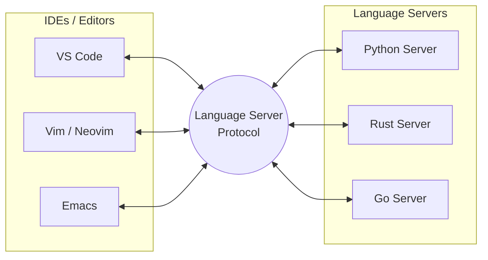

By installing the appropriate Language Server for your language (e.g., Python's `pylsp` or Rust's `rust-analyzer`), your editor gains semantic understanding of your code, enabling:

* **Inline Documentation:** Hovering over functions to see their docstrings.
* **Navigation:** Finding all references of a variable or jumping to a struct's definition.
* **Quality of Life:** Auto-importing missing modules as you type and highlighting syntax errors before compilation.

---

## AI-Powered Development

Large Language Models (LLMs) have fundamentally changed how code is written. Tools like GitHub Copilot and Cursor integrate directly into the IDE to assist with writing and refactoring.

### Three Modes of AI Interaction

1. **Autocomplete (Passive):**
* As you type, the AI suggests code past your cursor (often grayed out). You press `Tab` to accept.
* **Steering:** You can guide the autocomplete by writing comments or docstrings. Writing a clear, descriptive docstring (e.g., *"Extract all links from the given markdown document"*) results in much more accurate and useful auto-completions than vague inline comments.

2. **Inline Chat (Targeted):**
* You highlight a specific block of code and bring up a prompt (e.g., `Cmd+I` in VS Code).
* You give a command like *"Remove third-party libraries"* or *"Refactor this to use a switch statement"*.
* The AI proposes a diff (red for deletions, green for additions) that you can review and accept.

3. **Coding Agents (Conversational/Autonomous):**
* A chat interface with broader context about your codebase.
* You can ask it to explain code, brainstorm architectures, or find bugs. It operates more like an interactive pair-programmer.

### Best Practices for AI Tools

* **Review Everything:** LLMs are probabilistic token-predictors, not logic engines. They will confidently produce code that looks correct but contains subtle bugs or hallucinates non-existent methods.
* **Find the Right Abstraction Level:** AI tools excel at boilerplate and well-documented algorithmic tasks. If a task is too complex, the AI will fail. Learn to gauge what the AI is capable of handling, and delegate accordingly.
* **Privacy Note:** Cloud-based AI tools send your code to external servers. For highly sensitive code, check the privacy settings of your tool (e.g., disabling data retention) or look into local models, though local models currently offer less capability.

# Topic 4: Debugging and Profiling

Computers execute exact instructions rather than our intended logic, making debugging and profiling essential skills. Below are structured notes on the core concepts, tools, and methodologies for inspecting, fixing, and optimizing code.

---

## Debugging Methodologies & Tools

The goal of debugging is to close the gap between what you intended the computer to do and what it actually did.

### Logging and Print Debugging

Print debugging is highly effective but requires restarting the process from scratch. Logging provides a principled, persistent approach to outputting system state.

**Types of Logging:**

* **Unstructured:** Plain text logs describing program flow.
* **Structured:** JSON blobs or metrics that can be parsed by shell tools.

| Log Level | Purpose |
| --- | --- |
| **TRACE/DEBUG** | Verbose execution details, typically used only during active development. |
| **INFO** | Normal operational events and state changes. |
| **WARN** | Potential issues that do not immediately halt the program. |
| **ERROR/CRITICAL** | Severe failures requiring immediate attention. |

### Interactive Debuggers

General-purpose debuggers allow you to pause execution, introspect memory, and step through code interactively.

* **GDB / LLDB:** Used primarily for compiled languages (C, C++, Rust).
* **PDB:** Language-specific debugger for Python.

### Record-Replay Debugging (RR)

Traditional debuggers run forward; if you miss the origin of a bug, you must restart. Tools like `rr` (Record and Replay) record a program's entire execution, including system interactions, allowing you to step *backwards* in time.

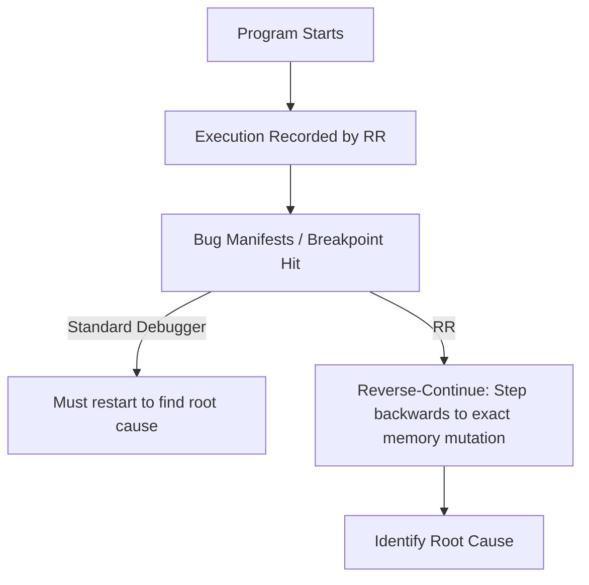

**Note on Heisenbugs:** Bugs that disappear or change behavior when observed (e.g., due to timing changes from print statements or deterministic schedulers in `rr`).

### System Call Tracing

When you need to understand what a black-box program is doing, trace its interactions with the operating system kernel.

* **strace:** Logs system calls (e.g., file opens, network reads). Useful flags include `-p` (attach to process ID), `-f` (follow child processes), and `-e` (filter by call type, like `%file`).
* **eBPF & bpftrace:** Advanced kernel-level tracing. Allows you to run sandbox programs in the Linux kernel to safely capture metrics (e.g., I/O latency distributions via `biolatency` or file access via `opensnoop`).

### Network Debugging

To inspect traffic entering or leaving a system without modifying code:

* **tcpdump:** Captures raw IP packets traversing a specific network interface.
* **Wireshark:** Analyzes packet contents with protocol-specific plugins (e.g., parsing MySQL queries over TCP).
* **mitmproxy:** Intercepts and decrypts HTTPS traffic by acting as a proxy.

### Sanitizers and CPU Emulators

* **Sanitizers:** Compiler extensions (e.g., `-fsanitize=address` in GCC/Clang) that inject checks to catch memory corruption or buffer overflows at runtime.
* **Valgrind:** A CPU emulator that interprets instructions directly. It detects memory mismanagement without recompiling the program but significantly slows down execution.

---

## Profiling Performance

Profiling applies debugging concepts to runtime speed and resource utilization. To optimize code, you must measure it accurately.

### Timing Execution

The simplest profiling technique uses the shell `time` command.

| Metric | Definition |
| --- | --- |
| **Real Time** | Wall-clock time from start to finish. |
| **User Time** | CPU time spent executing user-space code. |
| **Sys Time** | CPU time spent executing kernel-space code. |

*Wait Time (I/O or Network)* is the difference between Real Time and total CPU Time (User + Sys). For statistical benchmarking of competing programs, use **Hyperfine**.

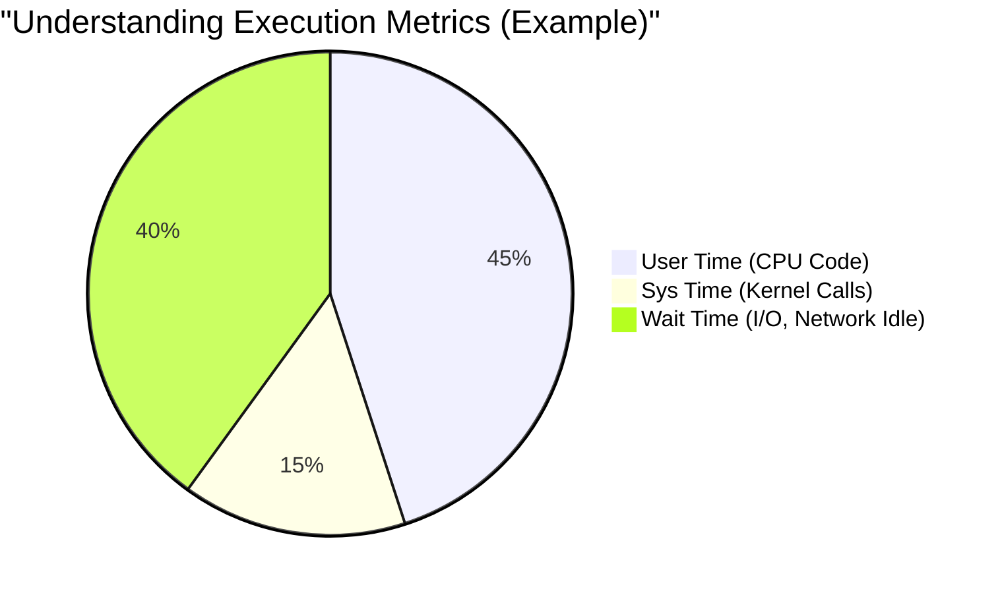

### Resource Monitoring

Before optimizing code, identify the hardware bottleneck using resource monitors.

* **CPU & Memory:** `htop`, `btop`, `free`
* **Disk I/O:** `iotop`
* **Network:** `nethogs`, `ss`
* **Open Files:** `lsof`

### Visualizing Performance Data

Raw profiling data is difficult to parse. Visualizations highlight the exact lines of code where execution time is concentrated.

* **perf:** A sampling profiler that interrupts the CPU at high frequencies to record the call stack. Used via `perf record` and `perf report`.
* **Flame Graphs:** SVG visualizations mapping stack traces to execution time. Wider bars represent functions consuming more CPU cycles.
* **Data Plotting Tools:** Tools like `gnuplot` (terminal-based), `matplotlib` (Python), and `ggplot2` (R) help plot algorithmic scaling against input sizes.

# Topic 5: Version Control (Git)

Version control systems (VCS) track changes to source code (or any files) over time, maintain a history of those changes, and facilitate collaboration. While Git is the de-facto standard today, it has a reputation for a confusing, "leaky" interface.

To use Git effectively without blindly memorizing commands or resorting to deleting your project when things go wrong, it is essential to understand it **bottom-up**, starting with its data model.

---

## Git's Data Model

Git models history as a collection of files and folders at specific points in time. Instead of storing a sequence of changes (deltas), Git stores a sequence of **snapshots**.

### Core Entities

* **Blob (File):** An array of bytes. It represents the contents of a file.
* **Tree (Directory):** A map linking names to other trees or blobs.
* **Snapshot:** The top-level tree being tracked.

### Commits and History

A **commit** is a snapshot along with some metadata (author, message, timestamp) and pointers to its **parents** (the commits that came immediately before it).

Because commits can have multiple parents (in the case of a merge) or multiple children (in the case of branching), Git history is modeled as a **Directed Acyclic Graph (DAG)**.

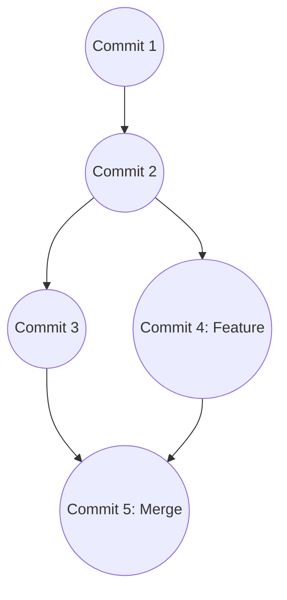

### The Object Store

Git unifies blobs, trees, and commits under the concept of an **Object**.

* All objects are content-addressed by their **SHA-1 hash** (a 40-character hexadecimal string).
* The object store is **immutable**. You can add new objects, but you cannot alter existing ones. If you change a file, its hash changes, creating a brand new object.

---

## References and `HEAD`

Because 40-character SHA-1 hashes are unreadable to humans, Git uses **References (Refs)**.

* **References are mutable.** They are human-readable pointers (like `main`, `master`, or `bugfix`) that point to specific commit hashes.
* **Branches** in Git are simply references. They do not contain their own isolated history; they are just lightweight, movable pointers to a commit.
* **`HEAD`** is a special reference that points to the commit (or branch) you are currently looking at in your working directory.
* *Detached HEAD state:* Occurs when `HEAD` points directly to a commit hash instead of a branch name. If you make commits here, they won't belong to any branch and will eventually be garbage collected if you switch away.

---

## The Staging Area

Instead of blindly taking a snapshot of everything in your directory at once, Git gives you fine-grained control over what goes into your next commit via the **Staging Area**.

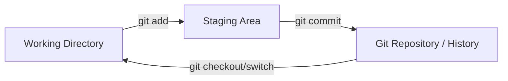

This allows you to work on multiple different things locally, but group related changes into clean, atomic commits.

---

## Core Command Line Interface

Understanding the data model clarifies what the commands are actually doing under the hood.

| Command | Action | Data Model Impact |
| --- | --- | --- |
| `git init` | Initializes a new repository. | Creates the hidden `.git` folder (empty object store and refs). |
| `git status` | Shows working directory status. | Compares working directory, staging area, and `HEAD`. |
| `git add <file>` | Stages a file. | Creates a blob object for the file and updates the staging area. |
| `git commit` | Commits staged changes. | Creates a new tree and commit object; updates the current branch ref to point to it. |
| `git log` | Shows commit history. | Traverses the DAG backwards from `HEAD`. Use `--graph` or `--all` for better views. |
| `git branch <name>` | Creates a branch. | Creates a new reference pointing to the current commit. |
| `git switch <name>` | Switches branches. | Moves `HEAD` to the specified branch and updates the working directory. |
| `git merge <name>` | Merges a branch into current. | Creates a new merge commit (with 2 parents) combining the histories. |

*Note: You can inspect raw Git objects by their SHA-1 hash using `git cat-file -t <hash>` (to see type) and `git cat-file -p <hash>` (to see contents).*

---

## Collaboration and Remotes

Git is purely a local, distributed version control tool. **GitHub** is a third-party hosting service for Git repositories.

A **remote** is simply another copy of your Git repository hosted elsewhere (e.g., on GitHub, GitLab, or a co-worker's machine). You collaborate by synchronizing your local DAG with the remote DAG.

* `git clone <url>`: Downloads a remote repository and sets it up locally.
* `git remote add <name> <url>`: Connects your local repository to a remote.
* `git push <remote> <branch>`: Sends your local commits and references to the remote object store.
* `git fetch`: Downloads objects and refs from the remote, but *does not* touch your working directory.
* `git pull`: Fetches data from the remote and immediately attempts to merge it into your local working branch.

### Diffing

While Git stores pure snapshots, it can easily compute the differences between them on the fly:

* `git diff`: Shows what has changed.
* `git log -p`: Shows the commit history along with the inline diffs for every single commit.

# Topic 6: Packaging and Shipping Code

Getting code to run on your own computer is only half the battle. Shipping code means ensuring that your application can run reliably on someone else's machine. These notes cover the mechanisms for isolating dependencies, building artifacts, and deploying robust applications.

---

## Dependencies & Environments

Code rarely exists in a vacuum; it relies on implicit dependencies like the programming language runtime, third-party libraries, and operating system features.

### Dependency Management

When you require a third-party library (e.g., `requests` in Python), you must fetch it from a central repository (like the Python Package Index, or PyPI). Package managers like `pip` or the newer, significantly faster `uv` handle this by downloading the requested library *and recursively resolving all of its dependencies*.

### Dependency Hell and Virtual Environments

If Project A requires `numpy > 2.0` and Project B requires `numpy < 2.0`, installing both globally creates an unresolvable conflict.

**Solution:** Use isolated environments.
A virtual environment (e.g., using `python -m venv my-env` or `uv venv`) creates an isolated folder containing a replica of the language runtime and its binaries. Activating it updates your shell's `PATH` to prioritize this isolated folder, ensuring project dependencies do not cross-contaminate.

---

## Artifacts & Packaging

An **artifact** is the final object that another user downloads and runs.

### Defining the Package

To make raw source code installable, you must define the "rules of the game." In modern Python, this is done using a `pyproject.toml` file, which specifies:

* Package metadata (name, version, description).
* Dependency constraints.
* Build systems.
* CLI entry points (e.g., creating a terminal command that maps to a specific Python function).

### Source Code vs. Pre-Built Binaries

* **Source Code:** Raw instructions. Requires the end-user to have the entire build toolchain installed to run it.
* **Pre-Built Binaries (Artifacts):** Compiled programs ready for execution. Because they are pre-built, you must distribute different versions mapped to specific **Operating Systems** (Linux, Windows, macOS) and **CPU Architectures** (x86_64, ARM/Apple Silicon).
* **Wheels:** In Python, a pre-built artifact is distributed as a `.whl` (Wheel) file, which is essentially a structured ZIP folder containing the code and metadata.

---

## Releases, Versioning & Reproducibility

To communicate compatibility to users, developers rely on **Semantic Versioning (SemVer)**, which uses three numbers: `Major.Minor.Patch` (e.g., `2.1.4`).

| Segment | Meaning | Example Scenario |
| --- | --- | --- |
| **Major** | Incompatible API changes | Renaming a core function. Old code *will* break. |
| **Minor** | New features, backward compatible | Adding a new endpoint. Old code still works. |
| **Patch** | Bug fixes, backward compatible | Fixing a security flaw. Old code still works. |

### Libraries vs. Applications

Your approach to versioning depends entirely on what you are building:

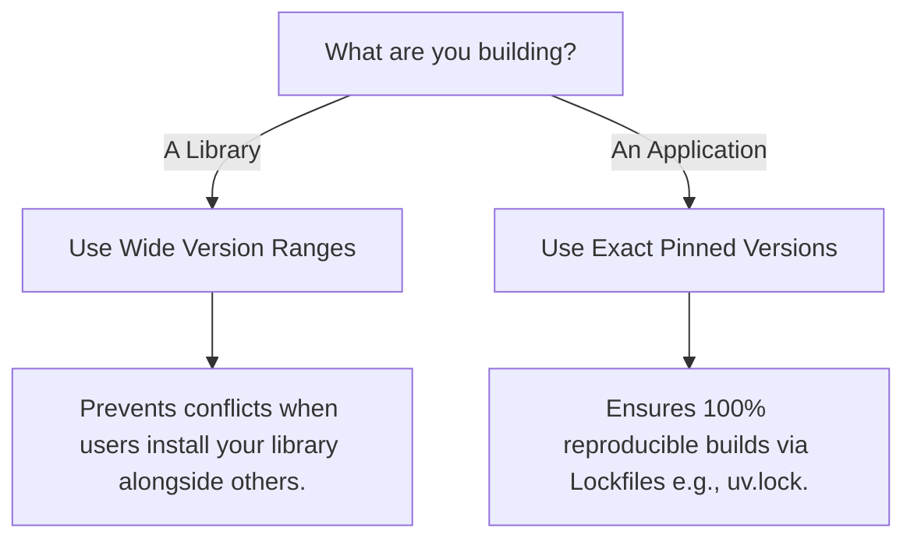

*Note: For absolute system-level reproducibility (including C-compilers and OS libraries), tools like **Nix** are used to manage every bit of variability on a computer.*

---

## Virtual Machines & Containers

When your code depends on external system features (like a specific CUDA version for GPU processing), language-level packaging (like Python's) is insufficient. You need to package the environment itself.

### The Evolution of Isolation

1. **Virtual Machines (VMs):** Ship an entire virtualized hardware stack and Operating System. Highly isolated, but massive overhead in storage and compute.
2. **Containers (Docker):** Isolate the application layer but reuse the host machine's OS kernel. Extremely lightweight and fast.

### Dockerfiles

A `Dockerfile` is a specialized script used to build a container image.

* Docker builds images in **layers**. Each command (`RUN`, `COPY`) creates a new cached layer.
* **Optimization:** To keep image sizes small (e.g., dropping from 2GB to 500MB), developers chain commands together (`apt update && apt install ... && rm -rf ...`) and disable caches when installing dependencies inside the final image.

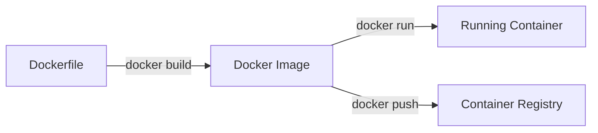

---

## Services & Orchestration

Modern applications are rarely just one isolated script; they often require a network of services (e.g., a Web App communicating with a PostgreSQL database).

* **Docker Compose:** A declarative YAML file used to orchestrate multi-container applications. It defines the required images, network ports, environment variables, and start-up dependencies (e.g., "Do not start the Web App until the Database is running").
* **Configuration:** Code should be written so it can deploy anywhere without modifying the source code. Use **environment variables** and CLI flags to handle configuration changes.
* **Systemd:** A Linux system and service manager used to orchestrate *when* your application starts. You can configure systemd to automatically trigger `docker compose up` if the physical server reboots.

---

## Publishing

Once your artifact is built, it needs a home so others can download it:

* **Python Packages:** Uploaded to **PyPI** (or TestPyPI for practice) using tools like `uv publish`.
* **Container Images:** Pushed to a **Container Registry** (like Docker Hub or GitHub Container Registry) using `docker push`.

As long as you and your collaborators have access to the same registry or GitHub repository, anyone can seamlessly download the exact environment and execute the code.
