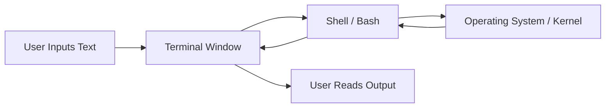
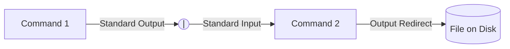
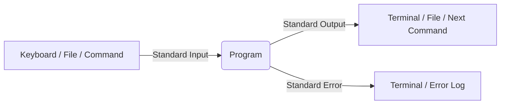
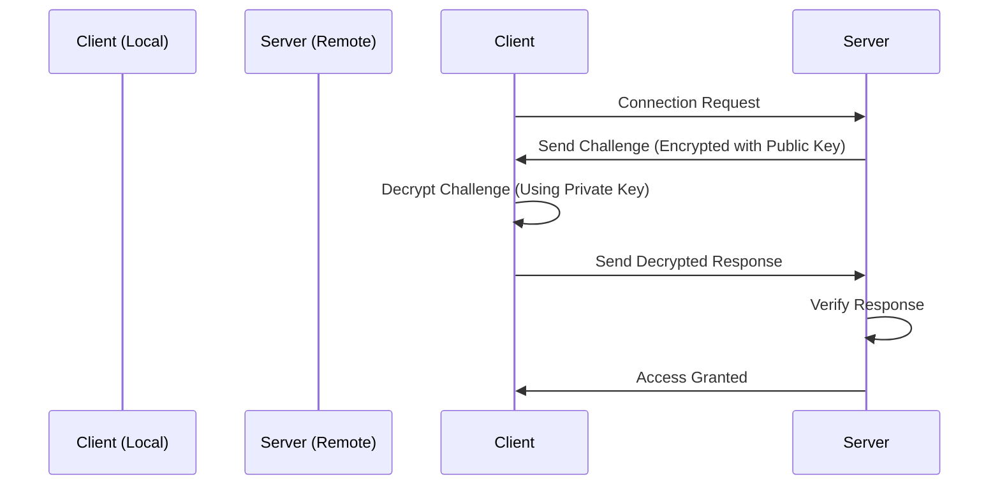

# Lecture Notes: The Missing Semester of Your CS Education

### Topic: The Shell & Command Line Environment

These notes condense the foundational concepts of navigating and utilizing the command-line interface, specifically focusing on the Bash shell.

---

## What is the Shell?

Computers offer multiple interfaces, such as Graphical User Interfaces (GUIs) and voice agents. However, GUIs are limited to the specific actions programmed by the developer. The **shell** is a textual interface that allows you to execute commands, chain programs together, and automate tasks at a lower, more flexible level.

* **Terminal:** The graphical window that displays the text.
* **Shell:** The underlying program (e.g., Bash, Zsh) parsing your text and executing commands.
* **Bash / Zsh:** The default shells on most Linux and macOS systems.
* **Windows Subsystem for Linux (WSL):** The recommended way to run a Bash-compatible environment on Windows.

---

## Navigating the File System

The shell operates within a directory structure. Your prompt usually indicates your current working directory.

* **`~` (Tilde):** A shortcut representing your user's home directory.
* **`/` (Slash):** The root directory of the entire file system. Also used to separate directory components.
* **`.` (Dot):** Represents the current directory.
* **`..` (Dot-Dot):** Represents the parent directory.
* **Absolute Paths:** Start with the root `/` or home `~` and define the full location.
* **Relative Paths:** Start from the current working directory without a leading slash.

| Command | Action |
| --- | --- |
| `cd <path>` | Changes the current directory to the specified path. |
| `ls` | Lists the files and directories in the current directory. |
| `ls -l` | Lists files with detailed permissions and metadata. |
| `pwd` | Prints the absolute path of the working directory. |

---

## Programs, Arguments, and The $PATH

Commands are executed by typing the program name followed by arguments separated by whitespace.

* **Argument Parsing:** The shell splits your input by spaces. To include literal spaces in a single argument, enclose the string in quotes (`"hello world"`) or escape the space with a backslash (`hello\ world`).
* **`$PATH`:** An environment variable containing a colon-separated list of directories. When you type a command, the shell searches these directories in order to find the executable program.
* **`which <program>`:** Tells you the exact file path of the executable the shell is running.
* **`man <program>`:** Opens the manual page for a command, explaining its arguments and flags. Alternatively, use `<program> --help`.

---

## Text Processing and Searching Tools

The command line provides powerful, specialized utilities for manipulating data and files.

| Utility | Function |
| --- | --- |
| `cat <file>` | Prints the entire contents of a file to the terminal. |
| `head -n <#>` | Prints the first n lines of a file. |
| `tail -n <#>` | Prints the last n lines of a file. |
| `sort` | Sorts lines lexicographically (use `-n` for numerical). |
| `uniq` | Removes *consecutive* duplicate lines (often paired with `sort`). |
| `uniq -c` | Removes consecutive duplicates and prints the count of occurrences. |

### Advanced Search and Manipulation

* **`grep`:** Searches *inside* files for specific text or Regular Expressions. Example: `grep -r "todo" .` searches recursively in the current directory for the word "todo".
* **`sed`:** A stream editor used primarily for search and replace. Example: `sed -i 's/grep/john/g' *.md` replaces "grep" with "john" globally across all markdown files.
* **`find`:** Searches for files based on metadata (name, size, modification time) rather than content. It can also execute commands on the results. Example: `find . -name "*.txt" -mtime +30` finds text files older than 30 days.
* **`awk`:** A programming language for parsing and processing column-based or delimited text files.

---

## I/O Redirection and Pipes

The true power of the shell comes from combining simple programs to accomplish complex tasks.

* **`>` (Output Redirect):** Captures the output of a command and writes it to a file, overwriting existing content. Example: `date > current_date.txt`.
* **`>>` (Append):** Captures output and adds it to the end of a file without overwriting.
* **`<` (Input Redirect):** Feeds the contents of a file into a program's standard input.
* **`|` (Pipe):** Takes the output of the program on the left and feeds it directly as the input to the program on the right.

---

## Bash Scripting Basics

You can save shell commands into a text file to create reproducible scripts. Bash is a full programming language with control structures.

* **Variables:** Assigned without spaces (e.g., `foo=bar`) and accessed with a dollar sign (`$foo`).
* **Command Substitution:** Wrapping a command in `$(...)` executes it and replaces the expression with its output. Example: `for var in $(seq 1 10)`.
* **Conditionals:** The `test` command (or `[ ]`) evaluates conditions. Returns `0` for true/success and non-zero for false/failure.
* **Execution Permissions:** To run a script, the file must be marked as executable.

**Creating and Running a Script:**

1. Start the file with a **Shebang** (`#!/bin/bash` or `#!/usr/bin/env python`). This tells the system which interpreter to use.
2. Write your commands.
3. Add execution permissions using `chmod +x script.sh`.
4. Execute it explicitly from the current directory using `./script.sh`.

### Topic: The Command Line Environment

These notes summarize the core concepts of the command line environment, focusing on how programs interact, how to operate on remote machines, and how to customize your workspace.

---

## Program Inputs: Arguments & Globbing

Unlike traditional programming languages where inputs are explicitly passed into defined functions, shell programs receive inputs primarily as strings via arguments.

* **Flags:** Arguments starting with a dash (`-`) or double dash (`--`) alter a program's default behavior. Single-letter flags can often be combined (e.g., `ls -la` is equivalent to `ls -l -a`).
* **Multiple Arguments:** Many programs accept an arbitrary number of arguments to apply the same operation across multiple targets (e.g., `mkdir dir1 dir2 dir3`).
* **Globbing:** The shell evaluates pattern matching *before* passing the input to the program. For example, if you run `touch *.py`, the shell expands `*.py` into a list of all matching files in the directory and passes that entire list to `touch`.

---

## Streams and Pipelines

Programs communicate via continuous data streams. When you pipe commands together using `|`, the programs run in parallel, instantly passing data down the chain as it gets produced.

* **Standard Input (stdin):** How a program reads data. Often represented by a lone dash `-` in commands if the program expects a file but you want it to read from the pipeline instead.
* **Standard Output (stdout):** Where a program sends its successful output. Can be redirected to a file using `>`.
* **Standard Error (stderr):** A separate stream specifically for error messages. This ensures errors are not accidentally processed by the next program in a pipeline or written to a standard output file.
* **`/dev/null`:** A special file that acts as a black hole. Writing standard output or error streams here simply discards the data.

---

## Environment Variables & Return Codes

Variables in the shell dictate how programs behave and how they find information.

* **Syntax:** Define variables without spaces (`foo=bar`). Access them with a dollar sign (`$foo`).
* **Local vs. Exported:** By default, variables only exist in the current shell session. Use `export debug=1` to ensure that any child processes spawned by the shell also inherit the variable.
* **Common Variables:** `$HOME` defines the user's home directory. `$TZ` defines the time zone. `$PATH` is a list of directories the shell searches to find executable commands.

**Return Codes**
Every program exits with a numerical return code (exit status) indicating success or failure.

* **`0`:** Success.
* **Non-zero (e.g., 1, 2):** Failure or error.
* **Control Flow:** The `&&` (AND) operator runs the next command *only* if the previous returned `0`. The `||` (OR) operator runs the next command *only* if the previous failed.

---

## Signals

Signals are software interrupts sent to a running program. A program can be programmed to catch a signal (e.g., to cleanly delete temporary files before closing) or ignore it completely.

| Keybind / Command | Signal | Description |
| --- | --- | --- |
| `Ctrl+C` | `SIGINT` | Interrupt signal. Requests the program to terminate. |
| `Ctrl+\` | `SIGQUIT` | Quit signal. A more forceful request to terminate. |
| `Ctrl+Z` | `SIGTSTP` | Suspend signal. Pauses the program and pushes it to the background. |
| `kill <PID>` | Any | A command used to send arbitrary signals to a specific Process ID. |

---

## Remote Machines & SSH

The Secure Shell (SSH) protocol allows you to control remote computers as if you were sitting in front of them.

* **Connecting:** `ssh username@server_address`
* **Public Key Authentication:** Instead of typing passwords, use cryptographic keys. Generate a pair using `ssh-keygen`.
* **Public Key:** Shared with the server (e.g., using `ssh-copy-id`). It identifies you.
* **Private Key:** Stays on your machine. *Never share this.* It is highly recommended to protect it with a local passphrase.
* **Remote Execution:** You can pass a command directly through SSH (e.g., `ssh user@server ls -l`). The command executes remotely, but the standard output streams back to your local terminal.
* **Copying Files:** Use Secure Copy (`scp local_file user@server:remote_path`) to transfer files over the SSH protocol.

---

## Terminal Multiplexers

When you disconnect from an SSH session, the server sends a `SIGHUP` (hangup) signal, terminating all your running programs. Terminal multiplexers (like `tmux`) prevent this by keeping a persistent session alive on the remote server.

* **Windows & Panes:** Allow you to run multiple terminal tabs (windows) and split screens (panes) within a single SSH connection.
* **Detaching (`Ctrl+b`, `d`):** Leaves the multiplexer running in the background. You can disconnect from SSH, go home, reconnect, and run `tmux attach` to pick up exactly where you left off.

---

## Customizing Your Environment

The shell is highly customizable, though setup varies between operating systems and specific shell programs (Bash vs. Zsh).

* **Package Managers:** Use tools like `brew` (macOS) or `apt` (Debian/Ubuntu) to install missing programs (e.g., `tmux`, `ripgrep`).
* **Configuration Files:** Changes made directly in the terminal (like `export PATH=...`) are lost when the session ends. To make them permanent, add them to your shell's configuration file (`~/.bashrc`, `~/.bash_profile`, or `~/.zshrc`).
* **Dotfiles:** It is best practice to store your configuration files in a version-controlled folder (like a Git repository) and use "symlinks" to point your operating system to them. This makes setting up a new computer frictionless.
* **Plugins:** Frameworks and independent plugins can add syntax highlighting, auto-completion, rich Git integrations in your prompt (`PS1`), and fuzzy-finding for your command history (e.g., `fzf` mapped to `Ctrl+R`).
