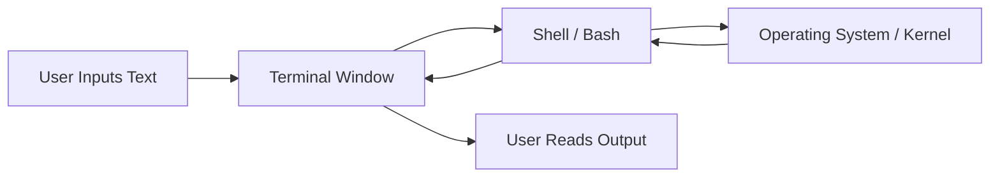
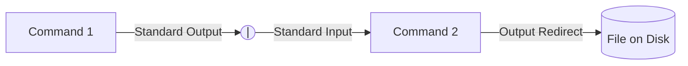

# Lecture Notes: The Missing Semester of Your CS Education

### Topic: The Shell & Command Line Environment

These notes condense the foundational concepts of navigating and utilizing the command-line interface, specifically focusing on the Bash shell.

---

## What is the Shell?

Computers offer multiple interfaces, such as Graphical User Interfaces (GUIs) and voice agents. However, GUIs are limited to the specific actions programmed by the developer. The **shell** is a textual interface that allows you to execute commands, chain programs together, and automate tasks at a lower, more flexible level.

* **Terminal:** The graphical window that displays the text.
* **Shell:** The underlying program (e.g., Bash, Zsh) parsing your text and executing commands.
* **Bash / Zsh:** The default shells on most Linux and macOS systems.
* **Windows Subsystem for Linux (WSL):** The recommended way to run a Bash-compatible environment on Windows.

---

## Navigating the File System

The shell operates within a directory structure. Your prompt usually indicates your current working directory.

* **`~` (Tilde):** A shortcut representing your user's home directory.
* **`/` (Slash):** The root directory of the entire file system. Also used to separate directory components.
* **`.` (Dot):** Represents the current directory.
* **`..` (Dot-Dot):** Represents the parent directory.
* **Absolute Paths:** Start with the root `/` or home `~` and define the full location.
* **Relative Paths:** Start from the current working directory without a leading slash.

| Command | Action |
| --- | --- |
| `cd <path>` | Changes the current directory to the specified path. |
| `ls` | Lists the files and directories in the current directory. |
| `ls -l` | Lists files with detailed permissions and metadata. |
| `pwd` | Prints the absolute path of the working directory. |

---

## Programs, Arguments, and The $PATH

Commands are executed by typing the program name followed by arguments separated by whitespace.

* **Argument Parsing:** The shell splits your input by spaces. To include literal spaces in a single argument, enclose the string in quotes (`"hello world"`) or escape the space with a backslash (`hello\ world`).
* **`$PATH`:** An environment variable containing a colon-separated list of directories. When you type a command, the shell searches these directories in order to find the executable program.
* **`which <program>`:** Tells you the exact file path of the executable the shell is running.
* **`man <program>`:** Opens the manual page for a command, explaining its arguments and flags. Alternatively, use `<program> --help`.

---

## Text Processing and Searching Tools

The command line provides powerful, specialized utilities for manipulating data and files.

| Utility | Function |
| --- | --- |
| `cat <file>` | Prints the entire contents of a file to the terminal. |
| `head -n <#>` | Prints the first n lines of a file. |
| `tail -n <#>` | Prints the last n lines of a file. |
| `sort` | Sorts lines lexicographically (use `-n` for numerical). |
| `uniq` | Removes *consecutive* duplicate lines (often paired with `sort`). |
| `uniq -c` | Removes consecutive duplicates and prints the count of occurrences. |

### Advanced Search and Manipulation

* **`grep`:** Searches *inside* files for specific text or Regular Expressions. Example: `grep -r "todo" .` searches recursively in the current directory for the word "todo".
* **`sed`:** A stream editor used primarily for search and replace. Example: `sed -i 's/grep/john/g' *.md` replaces "grep" with "john" globally across all markdown files.
* **`find`:** Searches for files based on metadata (name, size, modification time) rather than content. It can also execute commands on the results. Example: `find . -name "*.txt" -mtime +30` finds text files older than 30 days.
* **`awk`:** A programming language for parsing and processing column-based or delimited text files.

---

## I/O Redirection and Pipes

The true power of the shell comes from combining simple programs to accomplish complex tasks.

* **`>` (Output Redirect):** Captures the output of a command and writes it to a file, overwriting existing content. Example: `date > current_date.txt`.
* **`>>` (Append):** Captures output and adds it to the end of a file without overwriting.
* **`<` (Input Redirect):** Feeds the contents of a file into a program's standard input.
* **`|` (Pipe):** Takes the output of the program on the left and feeds it directly as the input to the program on the right.

---

## Bash Scripting Basics

You can save shell commands into a text file to create reproducible scripts. Bash is a full programming language with control structures.

* **Variables:** Assigned without spaces (e.g., `foo=bar`) and accessed with a dollar sign (`$foo`).
* **Command Substitution:** Wrapping a command in `$(...)` executes it and replaces the expression with its output. Example: `for var in $(seq 1 10)`.
* **Conditionals:** The `test` command (or `[ ]`) evaluates conditions. Returns `0` for true/success and non-zero for false/failure.
* **Execution Permissions:** To run a script, the file must be marked as executable.

**Creating and Running a Script:**

1. Start the file with a **Shebang** (`#!/bin/bash` or `#!/usr/bin/env python`). This tells the system which interpreter to use.
2. Write your commands.
3. Add execution permissions using `chmod +x script.sh`.
4. Execute it explicitly from the current directory using `./script.sh`.
